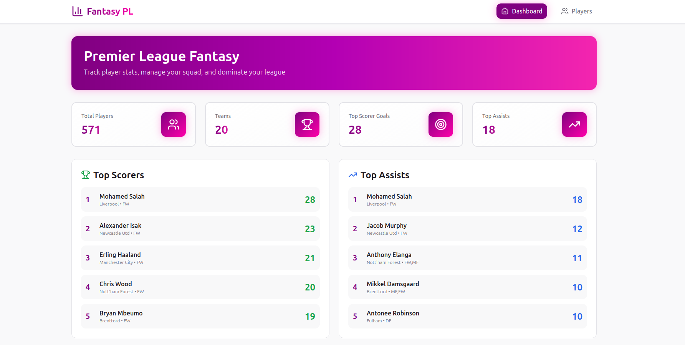
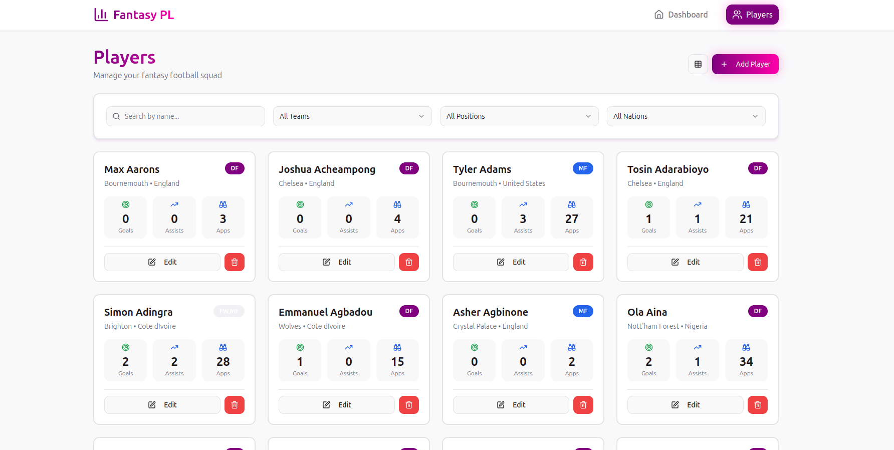

# Premier League Fantasy

A full-stack Premier League fantasy application built with **Spring Boot** for the backend and **React + Vite** for the frontend.

---

## Table of Contents

- [Project Overview](#project-overview)
- [Technologies](#technologies)
- [Setup](#setup)
- [API Endpoints](#api-endpoints)
- [License](#license)

---

## Project Overview

This project allows users to browse Premier League players, manage teams, and view stats. It consists of:

- **Backend**: Spring Boot + PostgreSQL
- **Frontend**: React + TypeScript + Vite + ShadCN UI
- **Features**:
  - CRUD operations for players
  - Filtering by team, position, nation
  - Responsive UI
 
#### Home Page


#### Player List


---

## Technologies

- Java 21, Spring Boot 3
- PostgreSQL
- React, TypeScript, Vite
- Maven, npm

---

## Setup

### Backend (Maven)

```bash
cd backend
mvn clean install
mvn spring-boot:run
```

### Backend (Docker)

```bash
cd backend

# Build the Docker image
docker build -t backend_docker .

# Run the container with environment variables
docker run --network="host" \
  -e SPRING_DATASOURCE_URL=jdbc:postgresql://<YOUR_DB_HOST>:5432/premier_league_fantasy \
  -e SPRING_DATASOURCE_USERNAME=<db_user> \
  -e SPRING_DATASOURCE_PASSWORD=<db_password> \
  -p 9090:8080 \
  backend_docker
```

### Frontend (Npm)

```bash
cd frontend
npm install
npm run dev
```
### Frontend (Docker)
```bash
cd frontend
docker build -t frontend_dev .
docker run --network="host" -v $(pwd):/app -e REACT_APP_API_URL=http://localhost:9090 frontend_dev
```

#### Notes:

- -v $(pwd):/app mounts your local frontend code for live reload.

- REACT_APP_API_URL tells the frontend where the backend is.

- Open your browser at http://localhost:5173 (or the port Vite shows in the console).


### API Endpoints

| Method | Endpoint                   | Description                |
| ------ | -------------------------- | -------------------------- |
| GET    | `/api/v1/player`           | Get all players            |
| GET    | `/api/v1/player?team=`     | Filter players by team     |
| GET    | `/api/v1/player?name=`     | Filter players by name     |
| GET    | `/api/v1/player?position=` | Filter players by position |
| GET    | `/api/v1/player?nation=`   | Filter players by nation   |
| POST   | `/api/v1/player`           | Add a new player           |
| PUT    | `/api/v1/player`           | Update a player            |
| DELETE | `/api/v1/player/{id}`      | Delete a player            |
